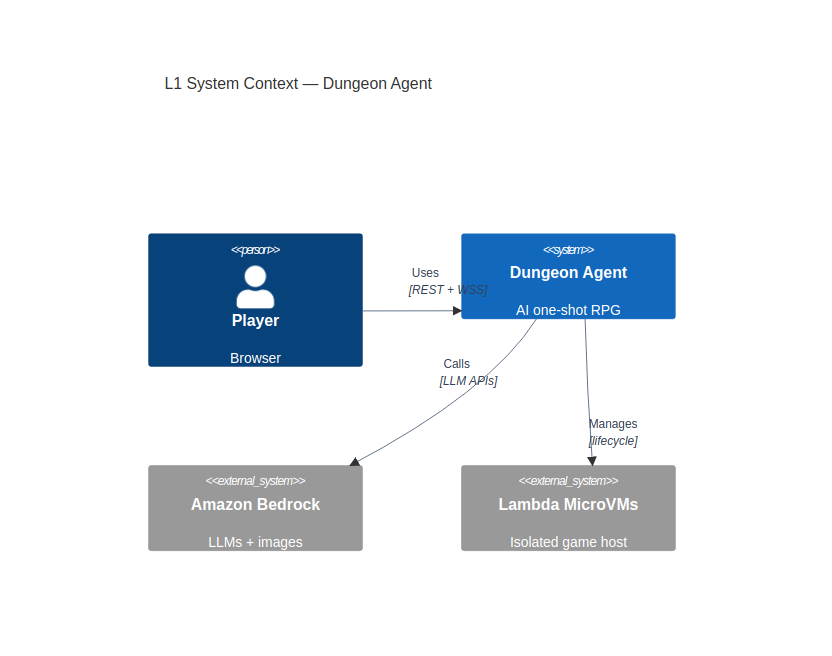
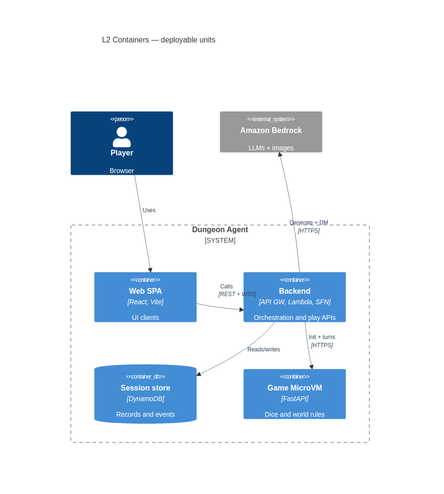

# Lambda MicroVM Dungeon Agent

> **Personal lab — not production code.**
>
> This repo is a one-dev sandbox for experimentation and learning. It is **not** a product, **not**
> a sample of how I write production systems, and **not** a claim that a dungeon game needs this
> much architecture.
>
> Parts of the design are deliberately overbuilt so I can practice real concepts hands-on — control
> plane vs data plane, Lambda MicroVMs, SAM deploy lanes, Bedrock agents, and so on. I also
> vibe-code here on purpose: exploring AI-assisted coding and training my own judgment of what the
> tools get right and wrong.
>
> If you're a recruiter or another engineer browsing: read the curiosity and the experiments, not
> the ceremony. For how I'd ship something for real users, ask me — this isn't that.

An AI one-shot RPG where a browser client talks to a sandbox AWS backend. Campaigns generate a
world and protagonist once; each play session forks that campaign into an isolated Lambda MicroVM
that owns dice and world mutations.

[](https://github.com/DavidCs9/lambda-microvm-dungeon-agent/actions/workflows/ci.yml)

## How this started

Weekend experiment to poke AWS Lambda MicroVMs: launch an isolated VM, hit a small FastAPI guest
over authenticated HTTPS, keep state across the lifecycle, measure latency. A tiny dungeon made
the infra test less boring. The dungeon was fun, so the lab grew into campaigns, a web client,
Bedrock architects, Polly narration, and deploy lanes — plus some intentional over-engineering so
the infra lessons stuck. Still one-dev, still a lab.

## What you play

1. **Sign in** — Cognito User Pool (admin-created users; no public signup). Lab auth, not a product
   identity system.
2. **Create a campaign** — pick a creative family (`action` / `exploration` / `social` /
   `mystery`); Adventure Architect + Character Architect (Bedrock) build a world and protagonist
   once. Optional portrait. No MicroVM.
3. **Start or resume a session** — fork a ready campaign into a dedicated MicroVM, or continue /
   abandon an active one from the menu. Zero model calls on the play-boot path.
4. **Act freely** — the Dungeon Master proposes outcomes; the MicroVM rolls the d20, validates,
   persists, and decides win/lose.
5. **Hear it** — Polly speech (data plane) for narration when configured.

Spanish is the showcase UI language; generation supports Spanish and English.

## Architecture (C4)

Educational diagrams of the lab shape — not a claim that a dungeon needs this much structure.
Full write-up, L3 planes, and sequences: [docs/architecture.md](docs/architecture.md).

### L1 — System context

Player browser → Dungeon Agent → Bedrock (LLMs/images) and Lambda MicroVMs (isolated game host).



### L2 — Containers

Deployable units inside the system boundary. The browser never talks to the MicroVM.



| Container | Role |
|---|---|
| **Web SPA** | React/Vite showcase UI (CloudFront/S3 in sandbox) |
| **Backend** | One SAM stack: API Gateway HTTP + WebSocket, Lambdas, Step Functions, Cognito |
| **Session store** | DynamoDB: campaigns, sessions, events, snapshots |
| **Game MicroVM** | FastAPI guest: dice, validate/apply world, no AWS credentials |

Inside the Backend package split (same deploy): **control plane** sets up campaigns/sessions;
**data plane** runs turns and speech; **plane_shared** holds contracts, DynamoDB, WS delivery, and
the MicroVM HTTP client. Details and more diagrams in the architecture doc.

## Play (web)

Needs the sandbox stack (`dungeon-agent-control-plane-sandbox` in `us-east-2`) and a current
MicroVM image the stack can launch. Deploys go through GitHub Actions on merge to `main` — see
[infra/README.md](infra/README.md) (unified sandbox release). Do not `sam deploy` from a laptop.

```sh
cd web
cp .env.example .env.local
# From CloudFormation outputs:
#   ApiUrl → VITE_HTTP_URL
#   WebSocketUrl → VITE_WS_URL
#   CognitoUserPoolId → VITE_COGNITO_USER_POOL_ID
#   CognitoUserPoolClientId → VITE_COGNITO_CLIENT_ID
npm install
npm run dev
```

HTTP auth is Cognito (`Authorization: Bearer` access token). WebSocket still passes `playerId`
(Cognito `sub`) as a sandbox convenience. Create users manually in the User Pool after deploy.

## Local MicroVM smoke (optional)

The Textual TUI / plain CLI still launch a one-shot session against a MicroVM for infra smoke tests.
That path is not the web play loop.

```sh
uv sync --all-groups
IMAGE_ARN="arn:aws:lambda:us-east-2:225989371926:microvm-image:dungeon-agent-fastapi"
IMAGE_VERSION="$(aws lambda-microvms get-microvm-image \
  --profile personal \
  --region us-east-2 \
  --image-identifier "$IMAGE_ARN" \
  --query latestActiveImageVersion \
  --output text)"

uv run --group tooling dungeon-agent \
  --profile personal \
  --region us-east-2 \
  --image-arn "$IMAGE_ARN" \
  --image-version "$IMAGE_VERSION"
```

Use `--language es|en`, `--plain`, `--no-voice`, `--no-music` as needed.

## Development

```sh
uv sync --all-groups
uv run ruff check .
uv run ruff format --check .
uv run mypy
uv run pytest
uv run python evals/gameplay_experience.py
```

Frontend: `cd web && npm run build` (or `npm run dev` against the sandbox API).

Guest FastAPI without a MicroVM:

```sh
DUNGEON_WORKSPACE_DIR="$(mktemp -d)" \
  uv run uvicorn dungeon_agent.api.main:app --reload
```

Local campaign seed sampling (no Bedrock): `uv run python scripts/sample_campaigns.py` and
`uv run python scripts/analyze_campaign_sample.py`.

## Repository map

- `web/` — showcase SPA
- `src/dungeon_agent/control_plane/` — campaign/session lifecycle, workflows, composition root
- `src/dungeon_agent/data_plane/` — turns, speech, live play events
- `src/dungeon_agent/plane_shared/` — HTTP/WS edge, DynamoDB, contracts, MicroVM client
- `src/dungeon_agent/api/` — FastAPI rules/state inside the MicroVM
- `src/dungeon_agent/domain/` — game schemas
- `src/dungeon_agent/orchestrator/`, `tui/`, `cli.py` — local MicroVM smoke path
- `src/dungeon_agent/operations/` — image build and benchmarks
- `infra/` — bootstrap, OIDC roles, SAM control-plane stack, web hosting (`infra/web/`)
- `docs/` — architecture (C4), RFCs, security notes
- `evals/`, `tests/`, `scripts/`

## CI and releases

PRs run path-filtered lanes (see [`.cursor/rules/deploy-lanes.mdc`](.cursor/rules/deploy-lanes.mdc)):

- `web/**` → frontend build
- control-plane / Python → ruff, mypy, pytest, gameplay evals
- MicroVM image paths → also ARM64 container build + source package

The aggregating **CI** check always reports.

Merges to `main` run [`.github/workflows/release.yml`](.github/workflows/release.yml): it detects
which lanes changed (MicroVM image, control plane, web hosting), deploys only those via GitHub
OIDC, then creates the next `v*` GitHub Release. Manual recovery:
`workflow_dispatch` on `deploy-control-plane.yml` / `deploy-web.yml`. Details:
[infra/README.md](infra/README.md).

Local image/benchmark entrypoints (tooling group):

```sh
uv run --group tooling python -m scripts.build_microvm_image
uv run --group tooling python -m scripts.benchmark_microvm
```

(Prefer the Actions release path for anything that should land in the sandbox.)

## Status

Personal experimental lab — see the disclaimer at the top. Not a production service. Keep secrets,
MicroVM tokens, `.env`, and session state out of git. Don't casually enable generated-code
execution or open egress.

See [CONTRIBUTING.md](CONTRIBUTING.md), [SECURITY.md](SECURITY.md), [CODE_OF_CONDUCT.md](CODE_OF_CONDUCT.md).
