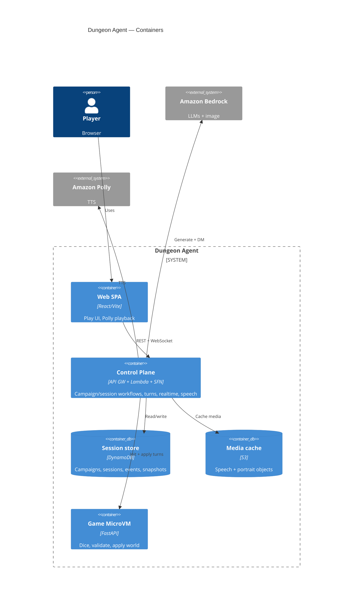

# Architecture

Dungeon Agent is an AI one-shot RPG. The primary path is a browser showcase client against a
sandbox AWS control plane: campaigns are generated with Bedrock and stored durably; play sessions
fork a ready campaign into an isolated Lambda MicroVM that owns dice and world mutations.

RFCs: [0001](rfcs/0001-web-control-plane.md) control plane, [0002](rfcs/0002-campaign-play-split.md)
campaign vs play, [0003](rfcs/0003-videogame-web-client.md) web client,
[0004](rfcs/0004-resume-existing-campaign.md) resume, [0007](rfcs/0007-live-polly-narrator.md)
speech. Deploy lanes: [`.cursor/rules/deploy-lanes.mdc`](../.cursor/rules/deploy-lanes.mdc).

## Trust boundary

Orchestration and model calls stay outside the MicroVM. The guest FastAPI process has no AWS
credentials: it only validates and applies turn proposals (d20, inventory/location rules, win/lose).
Sandbox auth today is `x-player-id` / WebSocket `playerId` (JWT later). See [security.md](security.md).

## System context

## Containers

Control plane here is one box: API Gateway HTTP + WebSocket, Lambdas (HTTP, realtime, workflow
tasks, turn worker), and Step Functions (create-campaign, create-session).

### Main flows

1. **Create campaign** — `POST /campaigns` starts create-campaign SFN: Bedrock adventure + character
   (optional portrait to S3) → DynamoDB artifacts → WebSocket `campaign.ready`. No MicroVM.
2. **Create session** — `POST /sessions` starts create-session SFN: launch MicroVM, fork campaign
   artifacts, `PUT /v1/adventure`, durable world snapshot → `session.ready`.
3. **Turn** — `POST /sessions/{id}/actions` accepts and async-invokes the turn worker: Bedrock
   Dungeon Master → `POST` MicroVM `/v1/turns` → snapshot + sequenced events (WS fan-out).

The browser never talks to the MicroVM. Idle MicroVMs may suspend; if gone, the turn worker
rehydrates from the DynamoDB snapshot.

A local CLI/TUI path (`cli.py`, `orchestrator/`) still exists for lab smoke tests; it is not the
web play path.

## Code map

- `web/` — showcase SPA (Vite/React)
- `src/dungeon_agent/control_plane/` — HTTP, realtime, workflow steps, turn worker, Bedrock agents,
  MicroVM manager, DynamoDB persistence
- `src/dungeon_agent/api/` — FastAPI guest inside the MicroVM (`/v1/adventure`, `/v1/turns`, …)
- `src/dungeon_agent/domain/` — framework-neutral game schemas
- `src/dungeon_agent/microvm.py` — shared authenticated HTTP to the guest
- `src/dungeon_agent/cli.py`, `orchestrator/`, `tui/` — local play / smoke path
- `src/dungeon_agent/operations/` — MicroVM image build and benchmarks
- `infra/control-plane/workflow/` — SAM stack for the sandbox control plane
- `evals/` — deterministic state safety and Bedrock comparisons

`scripts/` holds operational entrypoints (image build, lifecycle benchmark). Reusable behavior
stays in the `dungeon_agent` package.
