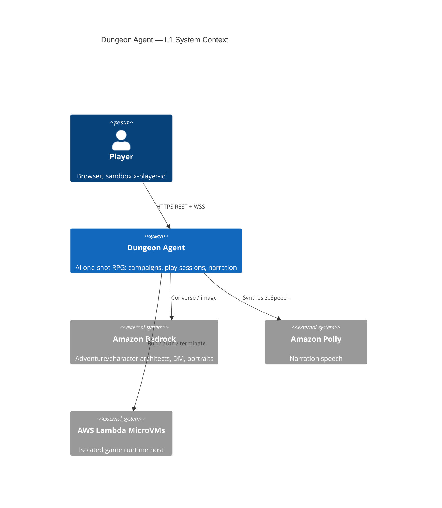
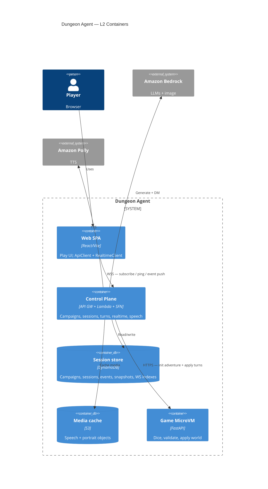
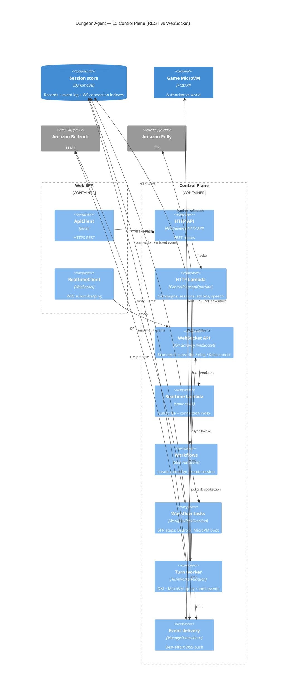

# Architecture

Dungeon Agent is an AI one-shot RPG. The primary path is a browser showcase client against a
sandbox AWS control plane: campaigns are generated with Bedrock and stored durably; play sessions
fork a ready campaign into an isolated Lambda MicroVM that owns dice and world mutations.

RFCs: [0001](rfcs/0001-web-control-plane.md) control plane, [0002](rfcs/0002-campaign-play-split.md)
campaign vs play, [0003](rfcs/0003-videogame-web-client.md) web client,
[0004](rfcs/0004-resume-existing-campaign.md) resume, [0007](rfcs/0007-live-polly-narrator.md)
speech. Deploy lanes: [`.cursor/rules/deploy-lanes.mdc`](../.cursor/rules/deploy-lanes.mdc).

## Trust boundary

Orchestration and model calls stay outside the MicroVM. The guest FastAPI process has no AWS
credentials: it only validates and applies turn proposals (d20, inventory/location rules, win/lose).
Sandbox auth today is `x-player-id` / WebSocket `playerId` (JWT later). See [security.md](security.md).

**The browser never talks to the MicroVM.** It only talks to the control plane over HTTPS REST and
WSS. DynamoDB is the source of truth for events; WebSocket delivery is best-effort fan-out.

## REST vs WebSocket (cheat sheet)

| Channel | Direction | Job | FE client |
|---|---|---|---|
| **HTTPS REST** | Browser → Control Plane | Commands and reads (create, list, get, act, speech, replay) | `web/src/net/api.ts` |
| **WSS** | Browser ↔ Control Plane | Live push of sequenced events; subscribe + ping | `web/src/net/ws.ts` |

| Use **REST** when… | Use **WebSocket** when… |
|---|---|
| You need a request/response (`202` accept, list campaigns, opening text, TTS URL) | Something finished asynchronously (`campaign.ready`, `turn.completed`, `narration.delta`) |
| You need durable replay (`GET …/events?after=N`) | You are already subscribed and want live updates |
| You submit a player action (`POST …/actions`) | You watch that turn stream after accept |

Config: `VITE_HTTP_URL` / `VITE_WS_URL` ← CloudFormation `ApiUrl` / `WebSocketUrl`
(`web/.env.example`).

---

## L1 — System context



At L1 the player sees one system. Internally that system splits REST commands from WS events (L2+).

---

## L2 — Containers

Control plane here is one box: API Gateway HTTP + WebSocket, Lambdas (HTTP, realtime, workflow
tasks, turn worker), and Step Functions (create-campaign, create-session).



### Main flows (still L2)

1. **Create campaign** — REST `POST /campaigns` → create-campaign SFN → Bedrock → DynamoDB →
   WSS `campaign.ready`. No MicroVM.
2. **Create session** — REST `POST /sessions` → create-session SFN → launch MicroVM →
   `PUT /v1/adventure` → snapshot → WSS `session.ready`.
3. **Turn** — REST `POST /sessions/{id}/actions` (`202` accept) → async turn worker → Bedrock DM →
   MicroVM `POST /v1/turns` → DynamoDB events → WSS fan-out (`turn.*`, `dice.rolled`,
   `narration.delta`).

Idle MicroVMs may suspend; if gone, the turn worker rehydrates from the DynamoDB snapshot.

A local CLI/TUI path (`cli.py`, `orchestrator/`) still exists for lab smoke tests; it is not the
web play path.

---

## L3 — Control plane components

Zoom into the Control Plane. This is where REST and WebSocket split into separate API Gateway
APIs and Lambdas.



### L3 REST surface (browser → HTTP API)

| Method | Path | Purpose |
|---|---|---|
| `POST` | `/campaigns` | Start campaign generation (SFN) |
| `GET` | `/campaigns` | List campaigns |
| `GET` | `/campaigns/{id}` | Campaign status |
| `GET` | `/campaigns/{id}/opening` | Opening document (+ portrait URL) |
| `GET` | `/campaigns/{id}/events` | Durable campaign event replay |
| `POST` | `/sessions` | Start play session from ready campaign (SFN) |
| `GET` | `/sessions` | List active sessions |
| `GET` | `/sessions/{id}` | Session status |
| `GET` | `/sessions/{id}/events` | Durable session event replay |
| `POST` | `/sessions/{id}/actions` | Submit player action → async turn worker |
| `POST` | `/sessions/{id}/abandon` | End session |
| `POST` | `/speech` | Polly TTS → cached URL |

Identity: header `x-player-id`. Mutating creates/actions also send `Idempotency-Key`.

### L3 WebSocket surface (browser ↔ WebSocket API)

| Client → server | Purpose |
|---|---|
| `$connect?playerId=` | Open connection |
| `{ "action": "subscribe", "campaignId" \| "sessionId", "afterSequence" }` | Bind to aggregate; may get missed events |
| `{ "action": "ping" }` | Keepalive → `{ "type": "pong" }` |
| `$disconnect` | Cleanup connection index |

| Server → client (pushed events) | When |
|---|---|
| `campaign.creation.started` / `campaign.phase.changed` / `campaign.creation.failed` / `campaign.ready` | Campaign SFN progress |
| `session.creation.started` / `session.phase.changed` / `session.creation.failed` / `session.ready` | Session SFN progress |
| `turn.started` / `dice.rolled` / `narration.delta` / `turn.completed` | Turn worker progress |
| `session.completed` | Abandon or win/lose |

Missed pushes: REST `GET …/events?after=N` (or subscribe with `afterSequence`).

### How one turn uses both channels

```text
1. REST  POST /sessions/{id}/actions     → 202 { turnId, status: "started" }
2. WSS   turn.started                    → UI locks / shows "thinking"
3. WSS   dice.rolled / narration.delta   → live feedback
4. WSS   turn.completed                  → UI unlocks for next action
5. REST  GET …/events?after=N            → only if WS dropped frames
```

---

## Code map

- `web/` — showcase SPA (Vite/React)
- `web/src/net/api.ts` — HTTPS REST client
- `web/src/net/ws.ts` — WSS realtime client
- `src/dungeon_agent/control_plane/` — HTTP, realtime, workflow steps, turn worker, Bedrock agents,
  MicroVM manager, DynamoDB persistence
- `src/dungeon_agent/control_plane/http/api_gateway.py` — REST route table
- `src/dungeon_agent/control_plane/realtime/api_gateway.py` — WS routes
- `src/dungeon_agent/control_plane/realtime/delivery.py` — `post_to_connection` fan-out
- `src/dungeon_agent/control_plane/turns.py` — turn worker
- `src/dungeon_agent/api/` — FastAPI guest inside the MicroVM (`/v1/adventure`, `/v1/turns`, …)
- `src/dungeon_agent/domain/` — framework-neutral game schemas
- `src/dungeon_agent/microvm.py` — shared authenticated HTTP to the guest
- `src/dungeon_agent/cli.py`, `orchestrator/`, `tui/` — local play / smoke path
- `src/dungeon_agent/operations/` — MicroVM image build and benchmarks
- `infra/control-plane/workflow/` — SAM stack for the sandbox control plane
- `evals/` — deterministic state safety and Bedrock comparisons

`scripts/` holds operational entrypoints (image build, lifecycle benchmark). Reusable behavior
stays in the `dungeon_agent` package.
