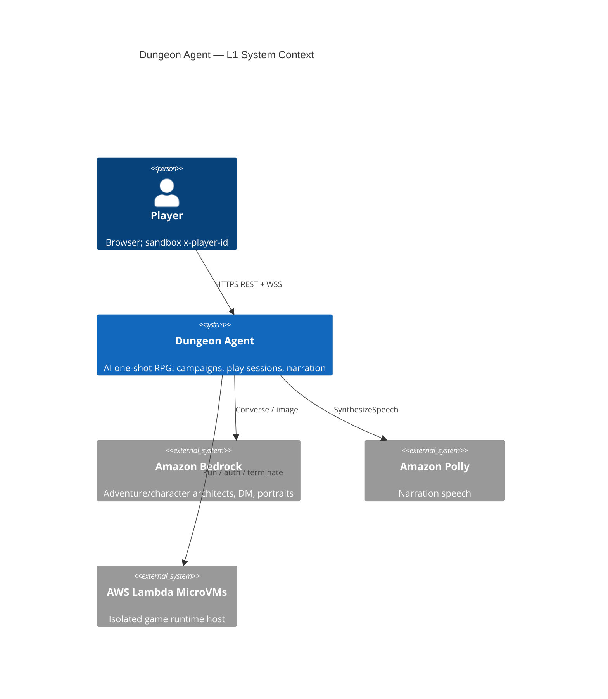
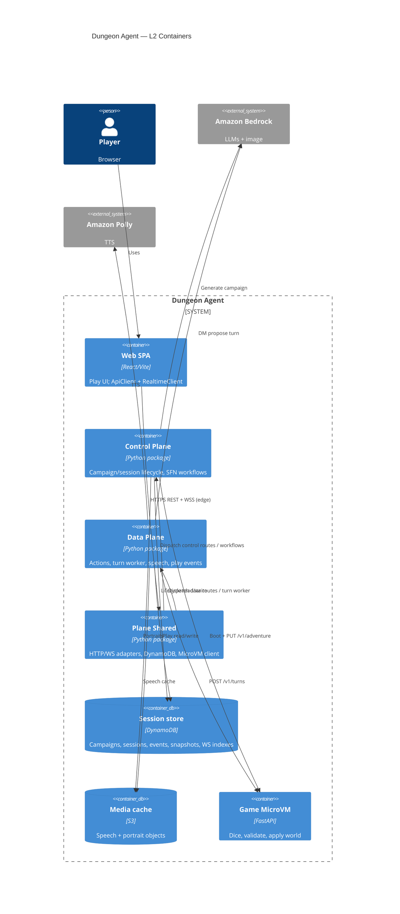
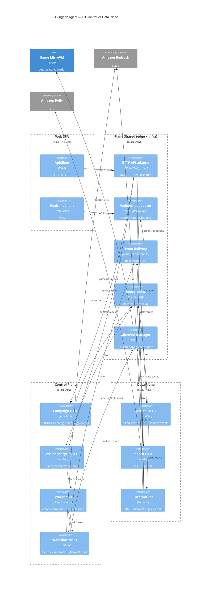

# Architecture

Dungeon Agent is an AI one-shot RPG. The primary path is a browser showcase client against a
sandbox AWS backend: campaigns are generated with Bedrock and stored durably; play sessions fork a
ready campaign into an isolated Lambda MicroVM that owns dice and world mutations.

RFCs: [0001](rfcs/0001-web-control-plane.md) control plane, [0002](rfcs/0002-campaign-play-split.md)
campaign vs play, [0003](rfcs/0003-videogame-web-client.md) web client,
[0004](rfcs/0004-resume-existing-campaign.md) resume, [0007](rfcs/0007-live-polly-narrator.md)
speech. Deploy lanes: [`.cursor/rules/deploy-lanes.mdc`](../.cursor/rules/deploy-lanes.mdc).

## Control plane vs data plane (lab taxonomy)

Same AWS deploy (one SAM stack, one HTTP API, one WebSocket API). Separate **packages** so the
concept is visible in code and C4:

| Plane | Question it answers | Package |
|---|---|---|
| **Control plane** | Create/configure/lifecycle: campaigns, sessions, MicroVM boot | `src/dungeon_agent/control_plane/` |
| **Data plane** | Live play traffic: actions, turns, speech, play event replay | `src/dungeon_agent/data_plane/` |
| **Shared** | Contracts, DynamoDB, WS transport, MicroVM HTTP client | `src/dungeon_agent/plane_shared/` |

**Mnemonic:** control plane *sets up* the game; data plane *runs* the game loop.

Composition root (Lambda handlers) stays at `control_plane.runtime` for stable SAM `Handler:` paths;
it wires both planes.

### REST endpoints by plane

| Plane | Method | Path |
|---|---|---|
| **Control** | `POST` | `/campaigns` |
| **Control** | `GET` | `/campaigns` |
| **Control** | `GET` | `/campaigns/{id}` |
| **Control** | `GET` | `/campaigns/{id}/events` |
| **Control** | `GET` | `/campaigns/{id}/opening` |
| **Control** | `POST` | `/sessions` |
| **Control** | `GET` | `/sessions` |
| **Control** | `GET` | `/sessions/{id}` |
| **Control** | `POST` | `/sessions/{id}/abandon` |
| **Data** | `POST` | `/sessions/{id}/actions` |
| **Data** | `GET` | `/sessions/{id}/events` |
| **Data** | `POST` | `/speech` |

Source of truth in code: `ROUTE_PLANE` in `plane_shared/http/api_gateway.py`.

### WebSocket by plane

Transport (`$connect` / `subscribe` / `ping` / `$disconnect`) is **shared**. Event *payloads* belong
to a plane:

| Plane | Pushed `type` values |
|---|---|
| **Control** | `campaign.*`, `session.creation.*`, `session.ready`, `session.phase.changed` (setup), `session.completed` (abandon/lifecycle) |
| **Data** | `turn.started`, `dice.rolled`, `narration.delta`, `turn.completed` |

Browser clients: REST → `web/src/net/api.ts`; WSS → `web/src/net/ws.ts`.

## Trust boundary (orthogonal to CP/DP)

Orchestration and model calls stay **outside** the MicroVM. The guest FastAPI process has no AWS
credentials: it only validates and applies turn proposals (d20, inventory/location rules, win/lose).
Sandbox auth today is `x-player-id` / WebSocket `playerId` (JWT later). See [security.md](security.md).

**The browser never talks to the MicroVM.** It only talks to the HTTP + WS APIs. DynamoDB is the
source of truth for events; WebSocket delivery is best-effort fan-out.

### REST vs WebSocket (channel cheat sheet)

| Channel | Direction | Job |
|---|---|---|
| **HTTPS REST** | Browser → API | Commands and reads |
| **WSS** | Browser ↔ API | Live push of sequenced events |

Config: `VITE_HTTP_URL` / `VITE_WS_URL` ← CloudFormation `ApiUrl` / `WebSocketUrl`
(`web/.env.example`).

---

## L1 — System context



---

## L2 — Containers

One deployable backend surface; two conceptual planes inside it.



### Main flows

1. **Create campaign (control)** — REST `POST /campaigns` → SFN → Bedrock → DynamoDB →
   WSS `campaign.ready`. No MicroVM.
2. **Create session (control)** — REST `POST /sessions` → SFN → launch MicroVM →
   `PUT /v1/adventure` → snapshot → WSS `session.ready`.
3. **Turn (data)** — REST `POST /sessions/{id}/actions` (`202`) → async turn worker → Bedrock DM →
   MicroVM `POST /v1/turns` → DynamoDB events → WSS `turn.*` / `dice.rolled` / `narration.delta`.

Idle MicroVMs may suspend; if gone, the turn worker rehydrates from the DynamoDB snapshot.

A local CLI/TUI path (`cli.py`, `orchestrator/`) still exists for lab smoke tests; it is not the
web play path.

---

## L3 — Components (planes + edge)



### How one turn uses both channels (data plane)

```text
1. REST  POST /sessions/{id}/actions     → 202 { turnId, status: "started" }   (data)
2. WSS   turn.started                    → UI locks
3. WSS   dice.rolled / narration.delta   → live feedback
4. WSS   turn.completed                  → UI unlocks
5. REST  GET …/events?after=N            → only if WS dropped frames            (data)
```

---

## Code map

- `web/` — showcase SPA (Vite/React)
- `web/src/net/api.ts` — HTTPS REST client
- `web/src/net/ws.ts` — WSS realtime client
- `src/dungeon_agent/control_plane/` — **control plane** (campaigns, session lifecycle, workflows)
- `src/dungeon_agent/data_plane/` — **data plane** (actions, turns, speech, DM agent)
- `src/dungeon_agent/plane_shared/` — shared contracts, persistence, realtime, MicroVM client, HTTP edge
- `src/dungeon_agent/control_plane/runtime.py` — Lambda entrypoints (wires both planes)
- `src/dungeon_agent/api/` — FastAPI guest inside the MicroVM (`/v1/adventure`, `/v1/turns`, …)
- `src/dungeon_agent/domain/` — framework-neutral game schemas
- `src/dungeon_agent/microvm.py` — shared authenticated HTTP to the guest
- `src/dungeon_agent/cli.py`, `orchestrator/`, `tui/` — local play / smoke path
- `src/dungeon_agent/operations/` — MicroVM image build and benchmarks
- `infra/control-plane/workflow/` — SAM stack (still named control-plane; deploys both planes)
- `evals/` — deterministic state safety and Bedrock comparisons

`scripts/` holds operational entrypoints (image build, lifecycle benchmark). Reusable behavior
stays in the `dungeon_agent` package.
