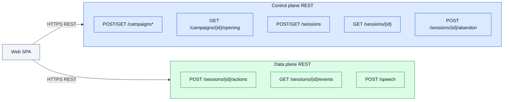
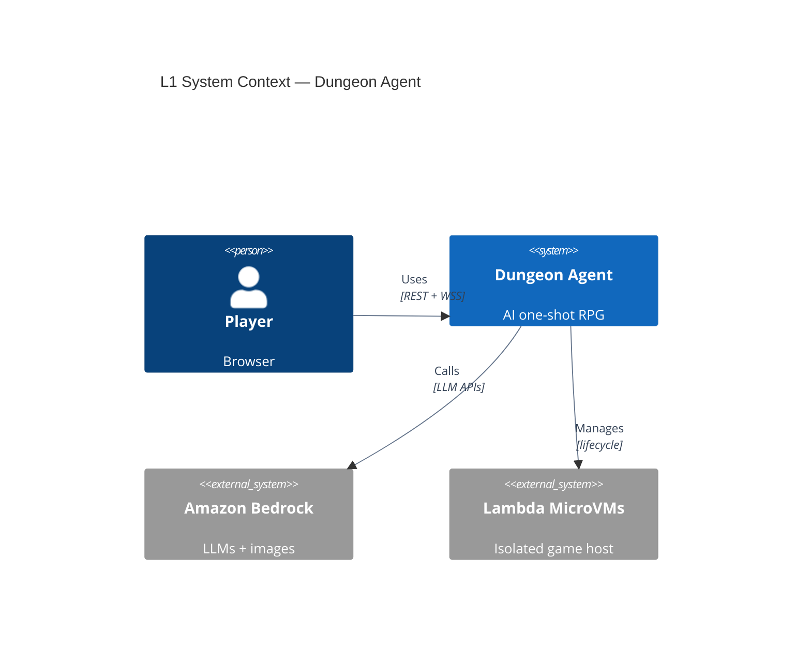
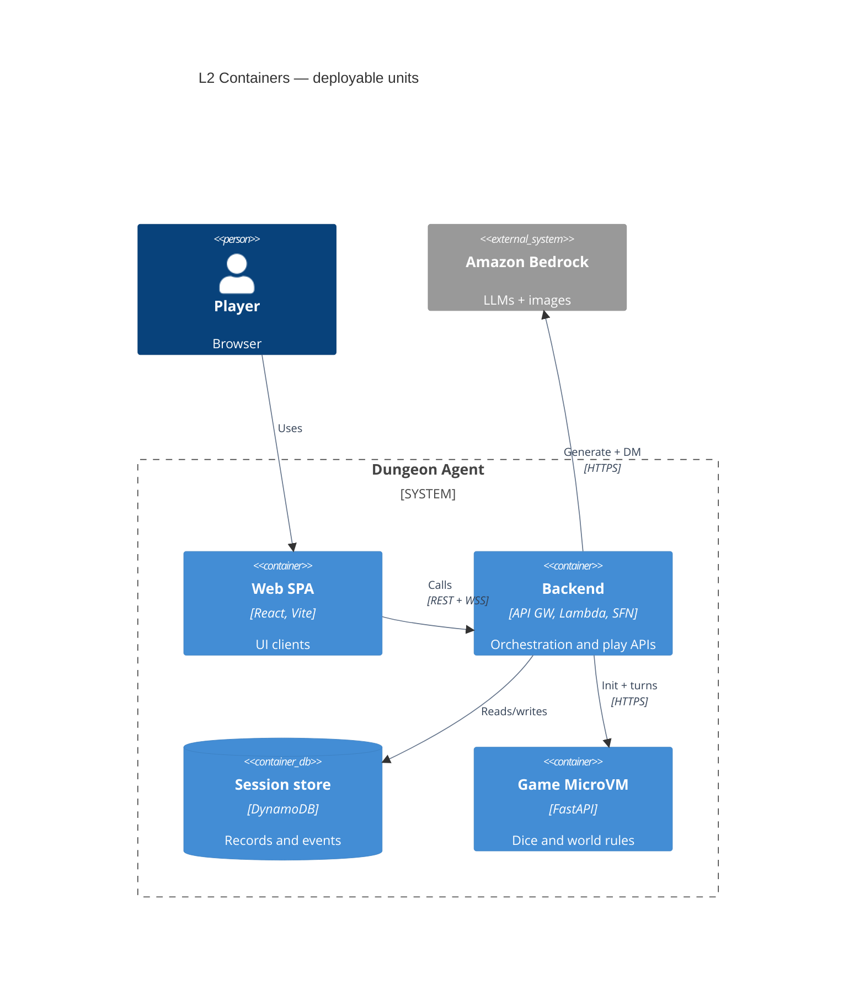
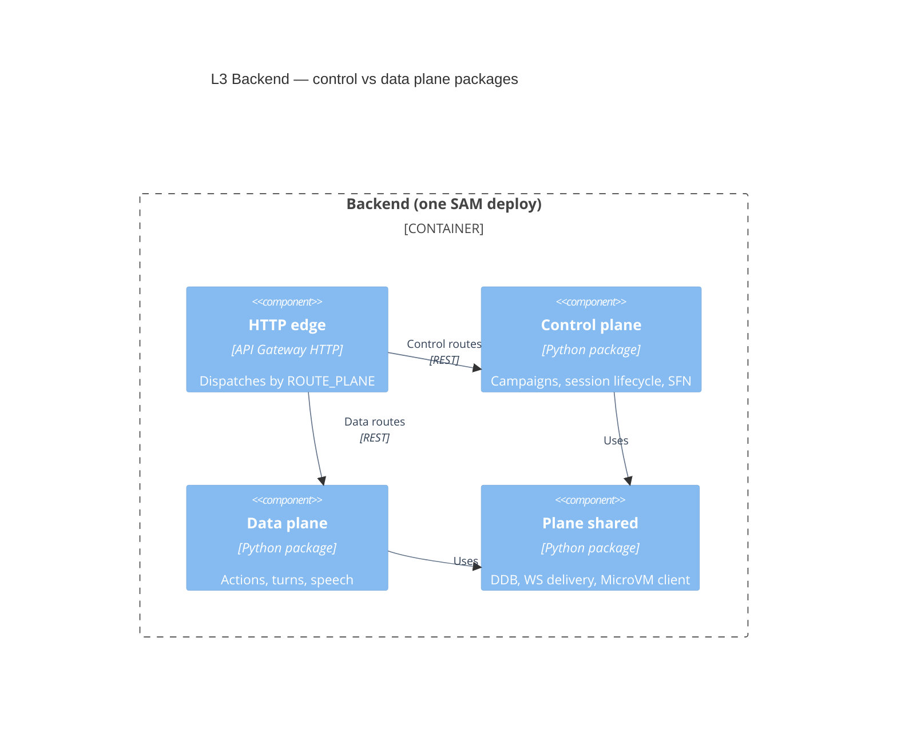
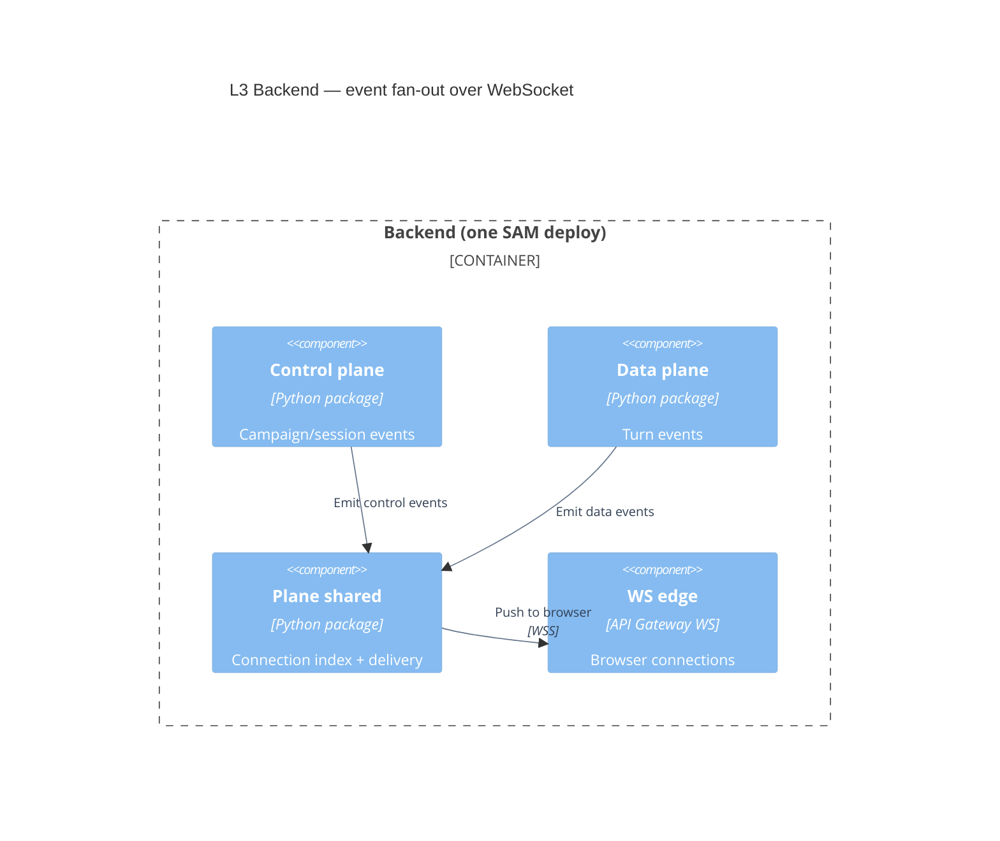
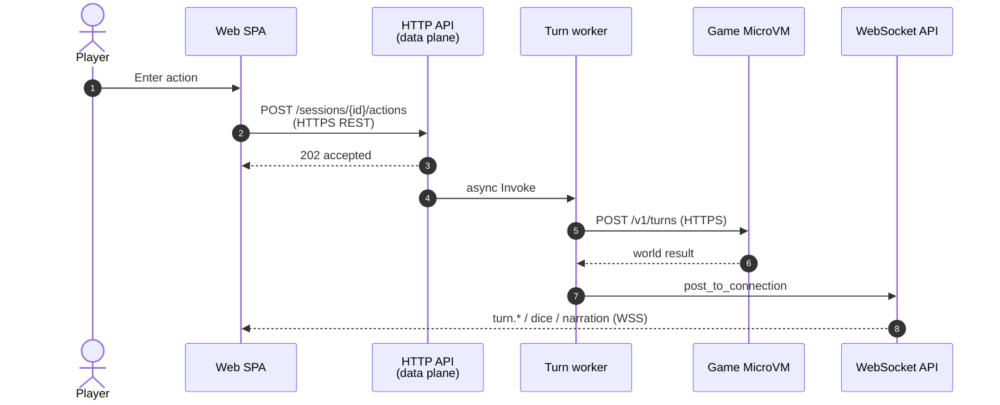

# Architecture

Dungeon Agent is an AI one-shot RPG. The primary path is a browser showcase client against a
sandbox AWS backend: campaigns are generated with Bedrock and stored durably; play sessions fork a
ready campaign into an isolated Lambda MicroVM that owns dice and world mutations.

RFCs: [0001](rfcs/0001-web-control-plane.md) control plane, [0002](rfcs/0002-campaign-play-split.md)
campaign vs play, [0003](rfcs/0003-videogame-web-client.md) web client,
[0004](rfcs/0004-resume-existing-campaign.md) resume, [0007](rfcs/0007-live-polly-narrator.md)
speech. Deploy lanes: [`.cursor/rules/deploy-lanes.mdc`](../.cursor/rules/deploy-lanes.mdc).

## Diagramming notes (C4 + Mermaid)

Based on the official [C4 model](https://c4model.com/) (Simon Brown) and
[Mermaid C4 syntax](https://mermaid.js.org/syntax/c4.html):

| Practice | How we apply it |
|---|---|
| One level of detail per diagram | L1 people/systems; L2 deployable containers; L3 packages inside Backend |
| Containers = deployable units | Web SPA, Backend (one SAM stack), DynamoDB, Game MicroVM — not Python packages |
| Planes are L3 components | `control_plane` / `data_plane` / `plane_shared` live inside Backend |
| Few relationships | Mermaid C4 layout breaks past ~5–6 edges; diagrams are split |
| Protocols on relationships | `REST`, `WSS`, `HTTPS` in the relationship technology field |
| Supporting diagrams for flows | Sequence diagram for a turn; flowchart for REST ownership |
| Progressive disclosure | Polly/S3 kept out of L1/L2 boxes (see tables below) so links stay readable |

Mermaid’s C4 renderer is experimental; these diagrams were **rendered to PNG and visually
checked** so arrows do not cross through unrelated boxes.

## Control plane vs data plane (lab taxonomy)

Same AWS deploy (one SAM stack, one HTTP API, one WebSocket API). Separate **packages** so the
concept is visible in code and at C4 L3:

| Plane | Question it answers | Package |
|---|---|---|
| **Control plane** | Create/configure/lifecycle: campaigns, sessions, MicroVM boot | `src/dungeon_agent/control_plane/` |
| **Data plane** | Live play traffic: actions, turns, speech, play event replay | `src/dungeon_agent/data_plane/` |
| **Shared** | Contracts, DynamoDB, WS transport, MicroVM HTTP client | `src/dungeon_agent/plane_shared/` |

**Mnemonic:** control plane *sets up* the game; data plane *runs* the game loop.

Composition root (Lambda handlers) stays at `control_plane.runtime` for stable SAM `Handler:` paths;
it wires both planes. Source of truth for REST ownership: `ROUTE_PLANE` in
`plane_shared/http/api_gateway.py`.

### REST endpoints by plane

### WebSocket by plane

Transport (`$connect` / `subscribe` / `ping` / `$disconnect`) is **shared**. Event *payloads*:

| Plane | Pushed `type` values |
|---|---|
| **Control** | `campaign.*`, `session.creation.*`, `session.ready`, setup `session.phase.changed`, abandon `session.completed` |
| **Data** | `turn.started`, `dice.rolled`, `narration.delta`, `turn.completed` |

Browser clients: REST → `web/src/net/api.ts`; WSS → `web/src/net/ws.ts`.

## Trust boundary (orthogonal to CP/DP)

Orchestration and model calls stay **outside** the MicroVM. The guest FastAPI process has no AWS
credentials: it only validates and applies turn proposals. Sandbox auth today is `x-player-id` /
WebSocket `playerId` (JWT later). See [security.md](security.md).

**The browser never talks to the MicroVM.** DynamoDB is the source of truth for events; WebSocket
delivery is best-effort fan-out.

Config: `VITE_HTTP_URL` / `VITE_WS_URL` ← CloudFormation `ApiUrl` / `WebSocketUrl`
(`web/.env.example`).

---

## L1 — System context

Audience: anyone. Shows people, the system, and important externals.

*(Amazon Polly omitted here so Mermaid links stay clean; it is used for TTS from the data plane.)*

---

## L2 — Containers

Audience: developers / ops. **Containers** here are separately runnable/deployable units
([C4 container diagram](https://c4model.com/diagrams/container)). The Backend is one SAM deploy;
control vs data plane packages appear at L3.

*(S3 media cache and Polly omitted from the box diagram for link clarity; Backend uses both.)*

### Main flows

1. **Create campaign (control)** — REST `POST /campaigns` → SFN → Bedrock → DynamoDB →
   WSS `campaign.ready`. No MicroVM.
2. **Create session (control)** — REST `POST /sessions` → SFN → launch MicroVM →
   `PUT /v1/adventure` → snapshot → WSS `session.ready`.
3. **Turn (data)** — REST `POST /sessions/{id}/actions` (`202`) → async turn worker → Bedrock DM →
   MicroVM `POST /v1/turns` → DynamoDB events → WSS `turn.*` / `dice.rolled` / `narration.delta`.

Idle MicroVMs may suspend; if gone, the turn worker rehydrates from the DynamoDB snapshot.

A local CLI/TUI path (`cli.py`, `orchestrator/`) still exists for lab smoke tests; it is not the
web play path.

---

## L3 — Backend components (planes)

Zoom into the **Backend** container. Packages are components, not separate deploys.

### REST dispatch (control vs data)

### WebSocket fan-out

### Dynamic — one player turn (data plane)

Supporting diagram (sequence is clearer than Mermaid `C4Dynamic` for numbered steps):

Missed WS frames: REST `GET /sessions/{id}/events?after=N` (data plane).

---

## Code map

- `web/` — showcase SPA (Vite/React)
- `web/src/net/api.ts` — HTTPS REST client
- `web/src/net/ws.ts` — WSS realtime client
- `src/dungeon_agent/control_plane/` — **control plane** (campaigns, session lifecycle, workflows)
- `src/dungeon_agent/data_plane/` — **data plane** (actions, turns, speech, DM agent)
- `src/dungeon_agent/plane_shared/` — shared contracts, persistence, realtime, MicroVM client, HTTP edge
- `src/dungeon_agent/control_plane/runtime.py` — Lambda entrypoints (wires both planes)
- `src/dungeon_agent/api/` — FastAPI guest inside the MicroVM (`/v1/adventure`, `/v1/turns`, …)
- `src/dungeon_agent/domain/` — framework-neutral game schemas
- `src/dungeon_agent/microvm.py` — shared authenticated HTTP to the guest
- `src/dungeon_agent/cli.py`, `orchestrator/`, `tui/` — local play / smoke path
- `src/dungeon_agent/operations/` — MicroVM image build and benchmarks
- `infra/control-plane/workflow/` — SAM stack (still named control-plane; deploys both planes)
- `evals/` — deterministic state safety and Bedrock comparisons

`scripts/` holds operational entrypoints (image build, lifecycle benchmark). Reusable behavior
stays in the `dungeon_agent` package.
